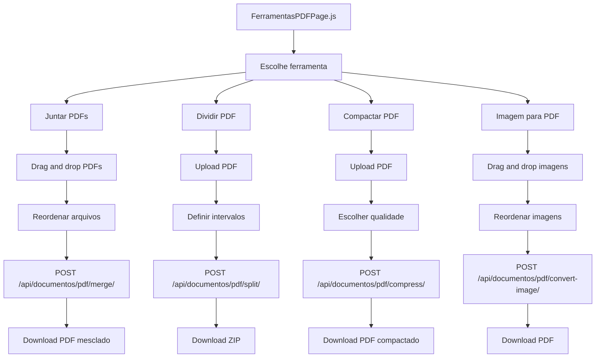

# Plano: Ferramentas de Tratamento de PDF

## Visão Geral

Implementar ferramentas de manipulação de PDF no sistema de advocacia:
1. Juntar PDFs (Merge)
2. Dividir PDF (Split)
3. Compactar PDF
4. Converter Imagem para PDF

## Arquitetura

### Backend

**Novo arquivo:** `backend/documentos/pdf_tools.py`
- Funções puras de manipulação de PDF usando `pypdf` (já instalado)
- Cada função recebe bytes, processa e retorna bytes

**Endpoints** (em `backend/documentos/views.py`):
- `POST /api/documentos/pdf/merge/` — Juntar PDFs
- `POST /api/documentos/pdf/split/` — Dividir PDF
- `POST /api/documentos/pdf/compress/` — Compactar PDF
- `POST /api/documentos/pdf/convert-image/` — Imagem → PDF

**URLs** (em `backend/documentos/urls.py`):
- Novo bloco de URLs prefixado com `pdf/`

### Frontend

**Nova página:** `frontend/src/pages/FerramentasPDFPage.js`
- Abas ou seções para cada ferramenta
- Drag and drop para upload de arquivos
- Preview e download do resultado

**Rota:** `/ferramentas-pdf` no `App.js`

---

## Etapa 1: Juntar PDFs (Merge)

### Backend

**Arquivo:** `backend/documentos/pdf_tools.py`

```python
from pypdf import PdfWriter, PdfReader

def merge_pdfs(arquivos_bytes: list[bytes]) -> bytes:
    """
    Junta múltiplos PDFs em um único arquivo.
    
    Args:
        arquivos_bytes: Lista de bytes de cada PDF
        
    Returns:
        Bytes do PDF mesclado
    """
    merger = PdfWriter()
    
    for pdf_bytes in arquivos_bytes:
        reader = PdfReader(pdf_bytes)
        merger.append(reader)
    
    output = BytesIO()
    merger.write(output)
    merger.close()
    
    return output.getvalue()
```

**View:** `backend/documentos/views.py`

```python
@api_view(['POST'])
@permission_classes([IsAuthenticated])
def merge_pdfs(request):
    """
    Junta múltiplos PDFs em um único arquivo.
    
    POST /api/documentos/pdf/merge/
    
    Args:
        arquivos: Lista de arquivos PDF (multipart)
    
    Returns:
        Arquivo PDF mesclado para download
    """
    files = request.FILES.getlist('arquivos')
    if len(files) < 2:
        return Response({'error': 'Envie pelo menos 2 PDFs.'}, status=400)
    
    arquivos_bytes = [f.read() for f in files]
    pdf_resultado = merge_pdfs(arquivos_bytes)
    
    response = HttpResponse(pdf_resultado, content_type='application/pdf')
    response['Content-Disposition'] = 'attachment; filename="merged.pdf"'
    return response
```

**URL:** `backend/documentos/urls.py`
```python
path('pdf/merge/', merge_pdfs, name='pdf-merge'),
```

### Frontend

**Componentes:**
- Área de drag and drop para arquivos
- Lista de arquivos com reordenação (drag to sort)
- Botão "Juntar PDFs"
- Barra de progresso
- Link para download do resultado

---

## Etapa 2: Dividir PDF (Split)

### Backend

```python
def split_pdf(pdf_bytes: bytes, page_ranges: list[tuple[int, int]]) -> list[bytes]:
    """
    Divide um PDF em múltiplos arquivos baseado em intervalos de páginas.
    
    Args:
        pdf_bytes: Bytes do PDF original
        page_ranges: Lista de tuplas (inicio, fim) para extrair
        
    Returns:
        Lista de bytes, um para cada intervalo
    """
    reader = PdfReader(pdf_bytes)
    resultados = []
    
    for start, end in page_ranges:
        writer = PdfWriter()
        for i in range(start - 1, end):  # páginas são 1-indexed
            writer.add_page(reader.pages[i])
        
        output = BytesIO()
        writer.write(output)
        writer.close()
        resultados.append(output.getvalue())
    
    return resultados
```

**Endpoint:** `POST /api/documentos/pdf/split/`
- Recebe: PDF + intervalos de páginas (ex: `[{"inicio": 1, "fim": 3}, {"inicio": 4, "fim": 5}]`)
- Retorna: ZIP com os PDFs divididos

---

## Etapa 3: Compactar PDF

### Backend

```python
def compress_pdf(pdf_bytes: bytes, quality: str = 'medium') -> bytes:
    """
    Compacta um PDF reduzindo o tamanho do arquivo.
    
    Args:
        pdf_bytes: Bytes do PDF original
        quality: 'low', 'medium', 'high'
        
    Returns:
        Bytes do PDF compactado
    """
    # Usa PyMuPDF (fitz) para recompressão de imagens
    import fitz
    
    doc = fitz.open(stream=pdf_bytes, filetype="pdf")
    
    quality_settings = {
        'low': {'dpi': 72, 'quality': 20},
        'medium': {'dpi': 150, 'quality': 50},
        'high': {'dpi': 200, 'quality': 80},
    }
    
    settings = quality_settings.get(quality, quality_settings['medium'])
    
    # Salva com compressão
    output = BytesIO()
    doc.save(output, garbage=4, deflate=True, clean=True)
    doc.close()
    
    return output.getvalue()
```

**Endpoint:** `POST /api/documentos/pdf/compress/`
- Recebe: PDF + nível de compressão (low/medium/high)
- Retorna: PDF compactado para download

---

## Etapa 4: Converter Imagem para PDF

### Backend

```python
def images_to_pdf(imagens_bytes: list[bytes]) -> bytes:
    """
    Converte uma ou mais imagens em um PDF.
    
    Args:
        imagens_bytes: Lista de bytes de imagens (jpg, png, etc.)
        
    Returns:
        Bytes do PDF gerado
    """
    from PIL import Image
    import io
    
    imagens = []
    for img_bytes in imagens_bytes:
        img = Image.open(io.BytesIO(img_bytes))
        if img.mode != 'RGB':
            img = img.convert('RGB')
        imagens.append(img)
    
    output = BytesIO()
    if len(imagens) == 1:
        imagens[0].save(output, format='PDF')
    else:
        imagens[0].save(output, format='PDF', save_all=True, append_images=imagens[1:])
    
    return output.getvalue()
```

**Endpoint:** `POST /api/documentos/pdf/convert-image/`
- Recebe: Uma ou mais imagens (multipart)
- Retorna: PDF gerado para download

---

## Cronograma de Implementação

| Etapa | O que | Arquivos | Deps novas? | Tempo |
|-------|-------|----------|-------------|-------|
| 1 | Juntar PDFs | `pdf_tools.py`, `views.py`, `urls.py`, `FerramentasPDFPage.js` | ❌ Não | ~2h |
| 2 | Dividir PDF | `pdf_tools.py`, `views.py`, `FerramentasPDFPage.js` | ❌ Não | ~1h |
| 3 | Compactar PDF | `pdf_tools.py`, `views.py`, `FerramentasPDFPage.js` | ❌ Não | ~1h |
| 4 | Imagem → PDF | `pdf_tools.py`, `views.py`, `FerramentasPDFPage.js` | ❌ Não | ~1h |
| 5 | Build + Deploy | `npm run build`, commit, push | — | ~30min |

**Total estimado:** ~5-6 horas

## Diagrama de Fluxo



## Observações

- `pypdf` já está instalado (v4.2.0) — suficiente para merge, split e compressão básica
- `PyMuPDF` (fitz) já está instalado (v1.26.5) — para compressão avançada
- `Pillow` já está instalado (v11.3.0) — para conversão de imagens
- **Nenhuma dependência nova necessária**
- O frontend usará React + MUI (já disponível)
- Para drag and drop, usaremos React puro (sem lib extra)
